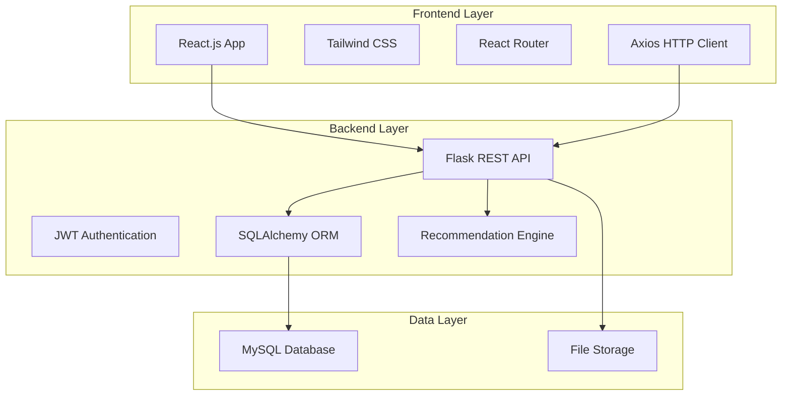
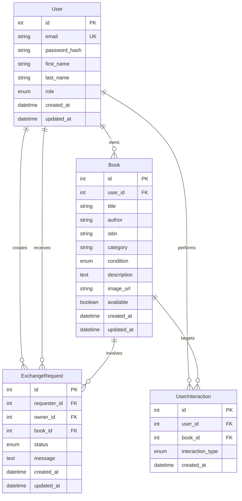

# Design Document

## Overview

The Advanced Online Book Exchange System is a full-stack web application built with React.js frontend and Python Flask backend. The system enables secure book trading between users through an intuitive interface, powered by AI-driven recommendations and comprehensive administrative controls. The architecture follows RESTful principles with JWT-based authentication and MySQL data persistence.

## Architecture

### High-Level Architecture



### Technology Stack

**Frontend:**
- React.js 18+ with functional components and hooks
- Tailwind CSS for responsive styling
- React Router for client-side routing
- Axios for HTTP requests
- React Hook Form for form handling

**Backend:**
- Python Flask with Flask-RESTful
- Flask-JWT-Extended for authentication
- SQLAlchemy ORM with Flask-SQLAlchemy
- Flask-CORS for cross-origin requests
- Werkzeug for file handling

**Database:**
- MySQL 8.0+ for data persistence
- SQLAlchemy migrations for schema management

**AI/ML:**
- scikit-learn for TF-IDF vectorization
- NumPy for numerical computations
- Pandas for data manipulation

## Components and Interfaces

### Frontend Components

#### Core Components
- **App.js**: Main application component with routing
- **AuthProvider**: Context provider for authentication state
- **ProtectedRoute**: Route wrapper for authenticated access
- **Layout**: Common layout with navigation and footer

#### Feature Components
- **LoginForm**: User authentication interface
- **RegisterForm**: User registration interface
- **BookCard**: Reusable book display component
- **BookForm**: Book listing creation/editing
- **SearchBar**: Advanced search and filtering
- **ExchangeRequest**: Exchange workflow management
- **RecommendationList**: AI-powered book suggestions
- **AdminDashboard**: Administrative interface

#### UI Components
- **Button**: Reusable button with variants
- **Input**: Form input with validation
- **Modal**: Overlay dialogs
- **LoadingSpinner**: Loading state indicator
- **ImageUpload**: File upload with preview

### Backend API Endpoints

#### Authentication Endpoints
```
POST /api/auth/register - User registration
POST /api/auth/login - User authentication
POST /api/auth/refresh - Token refresh
POST /api/auth/logout - User logout
```

#### User Management
```
GET /api/users/profile - Get user profile
PUT /api/users/profile - Update user profile
GET /api/users/{id}/books - Get user's books
```

#### Book Management
```
GET /api/books - List books with pagination/filtering
POST /api/books - Create book listing
GET /api/books/{id} - Get book details
PUT /api/books/{id} - Update book listing
DELETE /api/books/{id} - Delete book listing
POST /api/books/{id}/image - Upload book image
```

#### Exchange Management
```
GET /api/exchanges - List user's exchanges
POST /api/exchanges - Create exchange request
PUT /api/exchanges/{id} - Update exchange status
GET /api/exchanges/{id}/history - Get exchange history
```

#### Recommendations
```
GET /api/recommendations - Get personalized recommendations
POST /api/interactions - Record user interaction
```

#### Admin Endpoints
```
GET /api/admin/stats - System statistics
GET /api/admin/users - List all users
PUT /api/admin/users/{id}/role - Update user role
GET /api/admin/books/pending - Pending book approvals
PUT /api/admin/books/{id}/moderate - Moderate book listing
```

## Data Models

### Database Schema



### SQLAlchemy Models

#### User Model
```python
class User(db.Model):
    id = db.Column(db.Integer, primary_key=True)
    email = db.Column(db.String(120), unique=True, nullable=False)
    password_hash = db.Column(db.String(255), nullable=False)
    first_name = db.Column(db.String(50), nullable=False)
    last_name = db.Column(db.String(50), nullable=False)
    role = db.Column(db.Enum('user', 'admin'), default='user')
    created_at = db.Column(db.DateTime, default=datetime.utcnow)
    updated_at = db.Column(db.DateTime, default=datetime.utcnow, onupdate=datetime.utcnow)
    
    # Relationships
    books = db.relationship('Book', backref='owner', lazy=True)
    sent_requests = db.relationship('ExchangeRequest', foreign_keys='ExchangeRequest.requester_id', backref='requester', lazy=True)
    received_requests = db.relationship('ExchangeRequest', foreign_keys='ExchangeRequest.owner_id', backref='owner', lazy=True)
```

#### Book Model
```python
class Book(db.Model):
    id = db.Column(db.Integer, primary_key=True)
    user_id = db.Column(db.Integer, db.ForeignKey('user.id'), nullable=False)
    title = db.Column(db.String(200), nullable=False)
    author = db.Column(db.String(100), nullable=False)
    isbn = db.Column(db.String(20))
    category = db.Column(db.String(50), nullable=False)
    condition = db.Column(db.Enum('new', 'like_new', 'good', 'fair', 'poor'), nullable=False)
    description = db.Column(db.Text)
    image_url = db.Column(db.String(255))
    available = db.Column(db.Boolean, default=True)
    created_at = db.Column(db.DateTime, default=datetime.utcnow)
    updated_at = db.Column(db.DateTime, default=datetime.utcnow, onupdate=datetime.utcnow)
```

#### Exchange Request Model
```python
class ExchangeRequest(db.Model):
    id = db.Column(db.Integer, primary_key=True)
    requester_id = db.Column(db.Integer, db.ForeignKey('user.id'), nullable=False)
    owner_id = db.Column(db.Integer, db.ForeignKey('user.id'), nullable=False)
    book_id = db.Column(db.Integer, db.ForeignKey('book.id'), nullable=False)
    status = db.Column(db.Enum('pending', 'approved', 'rejected', 'completed'), default='pending')
    message = db.Column(db.Text)
    created_at = db.Column(db.DateTime, default=datetime.utcnow)
    updated_at = db.Column(db.DateTime, default=datetime.utcnow, onupdate=datetime.utcnow)
```

## AI Recommendation Engine

### Content-Based Filtering Architecture

The recommendation system uses TF-IDF (Term Frequency-Inverse Document Frequency) vectorization combined with cosine similarity to suggest books based on user interaction history.

#### Implementation Approach

1. **Text Preprocessing**: Combine book title, author, category, and description into a single text corpus
2. **TF-IDF Vectorization**: Convert text data into numerical vectors using scikit-learn's TfidfVectorizer
3. **Similarity Calculation**: Compute cosine similarity between book vectors
4. **User Profiling**: Build user preference profiles based on interaction history
5. **Recommendation Generation**: Rank books by similarity to user preferences

#### Recommendation Algorithm

```python
class RecommendationEngine:
    def __init__(self):
        self.tfidf_vectorizer = TfidfVectorizer(
            max_features=5000,
            stop_words='english',
            ngram_range=(1, 2)
        )
        self.book_vectors = None
        self.similarity_matrix = None
    
    def build_corpus(self, books):
        """Combine book features into text corpus"""
        corpus = []
        for book in books:
            text = f"{book.title} {book.author} {book.category} {book.description or ''}"
            corpus.append(text.lower())
        return corpus
    
    def fit(self, books):
        """Train the recommendation model"""
        corpus = self.build_corpus(books)
        self.book_vectors = self.tfidf_vectorizer.fit_transform(corpus)
        self.similarity_matrix = cosine_similarity(self.book_vectors)
    
    def get_recommendations(self, user_interactions, num_recommendations=10):
        """Generate personalized recommendations"""
        # Build user profile from interactions
        user_profile = self._build_user_profile(user_interactions)
        
        # Calculate similarity scores
        scores = cosine_similarity(user_profile, self.book_vectors).flatten()
        
        # Get top recommendations
        top_indices = scores.argsort()[-num_recommendations:][::-1]
        return top_indices, scores[top_indices]
```

### User Interaction Tracking

The system tracks user interactions to build preference profiles:

- **View**: User views book details
- **Like**: User marks book as favorite
- **Request**: User requests book exchange
- **Search**: User searches for specific terms

## Error Handling

### Frontend Error Handling

#### Error Boundary Component
```javascript
class ErrorBoundary extends React.Component {
  constructor(props) {
    super(props);
    this.state = { hasError: false, error: null };
  }
  
  static getDerivedStateFromError(error) {
    return { hasError: true, error };
  }
  
  componentDidCatch(error, errorInfo) {
    console.error('Error caught by boundary:', error, errorInfo);
  }
  
  render() {
    if (this.state.hasError) {
      return <ErrorFallback error={this.state.error} />;
    }
    return this.props.children;
  }
}
```

#### API Error Handling
```javascript
const apiClient = axios.create({
  baseURL: process.env.REACT_APP_API_URL,
  timeout: 10000,
});

apiClient.interceptors.response.use(
  (response) => response,
  (error) => {
    if (error.response?.status === 401) {
      // Handle authentication errors
      authService.logout();
      window.location.href = '/login';
    }
    return Promise.reject(error);
  }
);
```

### Backend Error Handling

#### Global Error Handler
```python
@app.errorhandler(ValidationError)
def handle_validation_error(e):
    return jsonify({
        'error': 'Validation Error',
        'message': str(e),
        'status_code': 400
    }), 400

@app.errorhandler(404)
def handle_not_found(e):
    return jsonify({
        'error': 'Resource Not Found',
        'message': 'The requested resource was not found',
        'status_code': 404
    }), 404

@app.errorhandler(500)
def handle_internal_error(e):
    db.session.rollback()
    return jsonify({
        'error': 'Internal Server Error',
        'message': 'An unexpected error occurred',
        'status_code': 500
    }), 500
```

#### Input Validation
```python
from marshmallow import Schema, fields, validate

class BookSchema(Schema):
    title = fields.Str(required=True, validate=validate.Length(min=1, max=200))
    author = fields.Str(required=True, validate=validate.Length(min=1, max=100))
    category = fields.Str(required=True, validate=validate.Length(min=1, max=50))
    condition = fields.Str(required=True, validate=validate.OneOf(['new', 'like_new', 'good', 'fair', 'poor']))
    description = fields.Str(validate=validate.Length(max=1000))
    isbn = fields.Str(validate=validate.Length(max=20))
```

## Security Considerations

### Authentication Security
- JWT tokens with configurable expiration
- Secure password hashing using bcrypt
- Token blacklisting for logout
- Refresh token rotation

### Input Validation
- Server-side validation for all inputs
- SQL injection prevention through ORM
- XSS protection with input sanitization
- File upload validation (type, size, content)

### API Security
- CORS configuration for allowed origins
- Rate limiting for API endpoints
- HTTPS enforcement in production
- Security headers (HSTS, CSP, etc.)

## File Upload Strategy

### Image Upload Implementation

#### Frontend Upload Component
```javascript
const ImageUpload = ({ onUpload, currentImage }) => {
  const [preview, setPreview] = useState(currentImage);
  const [uploading, setUploading] = useState(false);
  
  const handleFileSelect = async (file) => {
    if (!file) return;
    
    // Validate file
    if (!file.type.startsWith('image/')) {
      toast.error('Please select an image file');
      return;
    }
    
    if (file.size > 5 * 1024 * 1024) { // 5MB limit
      toast.error('File size must be less than 5MB');
      return;
    }
    
    // Create preview
    const reader = new FileReader();
    reader.onload = (e) => setPreview(e.target.result);
    reader.readAsDataURL(file);
    
    // Upload file
    setUploading(true);
    try {
      const formData = new FormData();
      formData.append('image', file);
      
      const response = await apiClient.post('/api/books/upload-image', formData, {
        headers: { 'Content-Type': 'multipart/form-data' }
      });
      
      onUpload(response.data.image_url);
    } catch (error) {
      toast.error('Failed to upload image');
    } finally {
      setUploading(false);
    }
  };
  
  return (
    <div className="space-y-4">
      <div className="border-2 border-dashed border-gray-300 rounded-lg p-6">
        {preview ? (
          
        ) : (
          <div className="text-center">
            <Upload className="mx-auto h-12 w-12 text-gray-400" />
            <p className="mt-2 text-sm text-gray-600">Click to upload image</p>
          </div>
        )}
      </div>
      <input
        type="file"
        accept="image/*"
        onChange={(e) => handleFileSelect(e.target.files[0])}
        className="hidden"
        id="image-upload"
      />
      <label
        htmlFor="image-upload"
        className="cursor-pointer inline-flex items-center px-4 py-2 border border-transparent text-sm font-medium rounded-md text-white bg-blue-600 hover:bg-blue-700"
      >
        {uploading ? 'Uploading...' : 'Choose Image'}
      </label>
    </div>
  );
};
```

#### Backend Upload Handler
```python
import os
from werkzeug.utils import secure_filename
from PIL import Image

UPLOAD_FOLDER = 'uploads/books'
ALLOWED_EXTENSIONS = {'png', 'jpg', 'jpeg', 'gif'}
MAX_FILE_SIZE = 5 * 1024 * 1024  # 5MB

def allowed_file(filename):
    return '.' in filename and filename.rsplit('.', 1)[1].lower() in ALLOWED_EXTENSIONS

@app.route('/api/books/upload-image', methods=['POST'])
@jwt_required()
def upload_book_image():
    if 'image' not in request.files:
        return jsonify({'error': 'No image file provided'}), 400
    
    file = request.files['image']
    if file.filename == '':
        return jsonify({'error': 'No file selected'}), 400
    
    if not allowed_file(file.filename):
        return jsonify({'error': 'Invalid file type'}), 400
    
    # Generate unique filename
    filename = secure_filename(f"{uuid.uuid4()}_{file.filename}")
    filepath = os.path.join(UPLOAD_FOLDER, filename)
    
    # Save and optimize image
    try:
        image = Image.open(file)
        image.thumbnail((800, 600), Image.Resampling.LANCZOS)
        image.save(filepath, optimize=True, quality=85)
        
        image_url = f"/uploads/books/{filename}"
        return jsonify({'image_url': image_url}), 200
    except Exception as e:
        return jsonify({'error': 'Failed to process image'}), 500
```

## Correctness Properties

*A property is a characteristic or behavior that should hold true across all valid executions of a system-essentially, a formal statement about what the system should do. Properties serve as the bridge between human-readable specifications and machine-verifiable correctness guarantees.*

### Property 1: User Registration and Authentication
*For any* valid user registration data, the system should create a new user account with securely hashed passwords, prevent duplicate email registrations, authenticate valid credentials with JWT tokens, and reject invalid credentials appropriately.
**Validates: Requirements 1.1, 1.2, 1.3, 1.4, 1.5, 1.6**

### Property 2: Role-Based Access Control
*For any* user in the system, they should be assigned a default "User" role upon creation, admin users should be able to promote other users to "Admin" role, and access to admin-only features should be restricted based on user roles with appropriate authorization errors for unauthorized access.
**Validates: Requirements 2.1, 2.2, 2.3, 2.4, 2.5**

### Property 3: Book Listing Management
*For any* book listing operation, the system should store all book details correctly during creation, validate and securely store uploaded images, maintain data integrity during updates, properly handle deletions with cascade effects, validate all inputs, and return complete book information when queried.
**Validates: Requirements 3.1, 3.2, 3.3, 3.4, 3.5, 3.6**

### Property 4: Advanced Search and Filtering
*For any* search or filter operation, the system should return books matching title searches (including partial matches), author searches, category filters, condition filters, and combined multiple filters, ensuring all results satisfy the specified criteria.
**Validates: Requirements 4.1, 4.2, 4.3, 4.4, 4.5, 4.6**

### Property 5: Exchange Request Workflow
*For any* exchange request operation, the system should create proper request records linking all parties, allow owners to approve or reject requests, update request statuses correctly, maintain complete history of all exchanges, and update book availability when exchanges are completed.
**Validates: Requirements 5.1, 5.2, 5.3, 5.4, 5.5, 5.6**

### Property 6: AI Recommendation Engine
*For any* recommendation generation, the system should analyze user interaction history using TF-IDF algorithms, calculate book similarities using cosine similarity, record all user interactions, generate recommendations based on user preferences, rank recommendations by relevance score, and update recommendations as user behavior changes.
**Validates: Requirements 6.1, 6.2, 6.3, 6.4, 6.5, 6.6**

### Property 7: Administrative Dashboard
*For any* admin dashboard operation, the system should display accurate statistics on users/books/exchanges, list all users with correct role information, allow content moderation actions, provide system analytics insights, and restrict dashboard access to admin users only.
**Validates: Requirements 7.1, 7.2, 7.3, 7.4, 7.5**

### Property 8: RESTful API Compliance
*For any* API endpoint, the system should follow RESTful conventions with appropriate HTTP methods, return correct success status codes (200, 201, 204) for successful operations, return appropriate error status codes (400, 401, 403, 404, 500) for failures, include meaningful error messages, validate all inputs with proper error responses, and maintain consistent response formats across all endpoints.
**Validates: Requirements 8.1, 8.2, 8.3, 8.4, 8.5, 8.6**

### Property 9: Data Integrity and Persistence
*For any* data operation, the system should maintain referential integrity between users and their book listings, preserve relationships between users, books, and exchange requests, enforce database constraints to prevent invalid data entry, and ensure all data persists correctly across operations.
**Validates: Requirements 9.2, 9.3, 9.4**

### Property 10: Security and Input Validation
*For any* user input or file upload, the system should validate inputs to prevent injection attacks, validate file types and sizes for uploads, handle errors without exposing sensitive information, implement secure HTTP headers and CORS policies, and log security-relevant events for monitoring.
**Validates: Requirements 10.1, 10.2, 10.3, 10.4, 10.5**

### Property 11: Error Message Quality
*For any* error condition, the system should display user-friendly error messages that provide helpful information without exposing sensitive system details.
**Validates: Requirements 11.4**

## Testing Strategy

### Dual Testing Approach

The system will implement both unit testing and property-based testing to ensure comprehensive coverage:

**Unit Tests:**
- Specific examples demonstrating correct behavior
- Edge cases and boundary conditions
- Error handling scenarios
- Integration points between components
- Authentication and authorization flows
- File upload validation
- Database constraint enforcement

**Property-Based Tests:**
- Universal properties across all valid inputs
- Comprehensive input coverage through randomization
- Minimum 100 iterations per property test
- Each test tagged with feature and property reference
- Focus on core business logic validation

### Property-Based Testing Configuration

**Testing Framework:** pytest with Hypothesis for property-based testing
**Minimum Iterations:** 100 per property test
**Test Tagging Format:** `# Feature: book-exchange-system, Property {number}: {property_text}`

### Test Categories

1. **Authentication Tests**
   - Unit: Specific login/registration scenarios
   - Property: Authentication behavior across all valid/invalid inputs

2. **Book Management Tests**
   - Unit: CRUD operations with specific data
   - Property: Book operations across all valid book data

3. **Search and Filter Tests**
   - Unit: Specific search scenarios
   - Property: Search behavior across all query types

4. **Exchange Workflow Tests**
   - Unit: Specific exchange scenarios
   - Property: Exchange operations across all valid requests

5. **Recommendation Engine Tests**
   - Unit: Specific recommendation scenarios
   - Property: Recommendation generation across all user profiles

6. **API Compliance Tests**
   - Unit: Specific endpoint behaviors
   - Property: RESTful compliance across all endpoints

7. **Security Tests**
   - Unit: Specific security scenarios
   - Property: Security validation across all inputs

### Testing Tools and Libraries

**Backend Testing:**
- pytest for test framework
- Hypothesis for property-based testing
- Factory Boy for test data generation
- pytest-flask for Flask testing utilities
- pytest-cov for coverage reporting

**Frontend Testing:**
- Jest for unit testing
- React Testing Library for component testing
- MSW (Mock Service Worker) for API mocking
- fast-check for property-based testing in JavaScript

### Test Data Strategy

**Test Database:**
- Separate test database with identical schema
- Database fixtures for consistent test state
- Transaction rollback after each test
- Seed data for integration testing

**Mock Data Generation:**
- Faker library for realistic test data
- Custom factories for domain-specific objects
- Property-based test generators for comprehensive coverage
- Image file mocks for upload testing

The testing strategy ensures that both specific use cases and general system properties are thoroughly validated, providing confidence in system correctness and reliability.